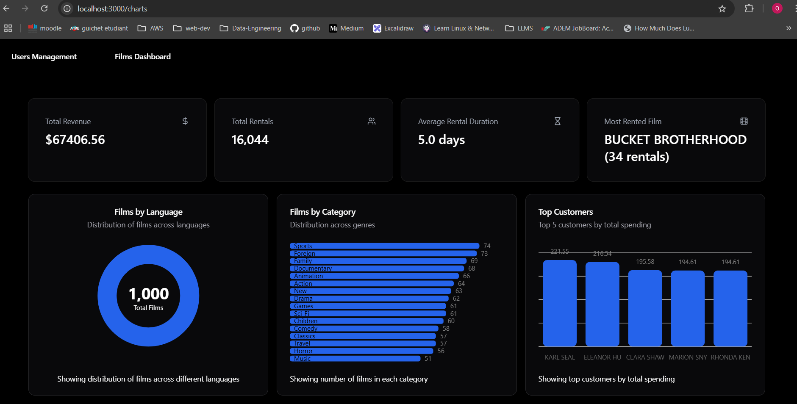

# Sakila Dashboard

This project is a dashboard application for visualizing film data, built using FastAPI for the backend and React for the frontend. It offers various features such as displaying films by language and category, monitoring key performance indicators (KPIs), and overseeing user activity.




## Tools and Technologies Used

### Backend
- **FastAPI**
- **SQLAlchemy**
- **MySQL**

### Frontend
- **React**
- **React Router**
- **Dnd Kit**
- **Shadcn UI**
- **Lucide React**

## Getting Started

### Prerequisites
- Ensure you have Docker and Docker Compose installed on your machine.

### Running the Application

1. **Clone the Repository**
   ```bash
   git clone https://github.com/Omar-Ouardighi/FastAPI-React-SakilaApp.git
   cd FastAPI-React-SakilaApp
   ```

2. **Build and Start the Containers**
   In the root directory of the project, run:
   ```bash
   docker-compose up --build
   ```

3. **Access the Application**
   - The backend API will be available at `http://localhost:8000`.
   - The frontend application will be available at `http://localhost:3000`.

### API Endpoints
- **GET /films-by-language**: Retrieve the count of films per language.
- **GET /kpis**: Retrieve various KPI metrics from the database.
- **GET /films-by-category**: Retrieve the count of films per category.
- **GET /top-customers**: Retrieve the top 5 customers by total payments.

